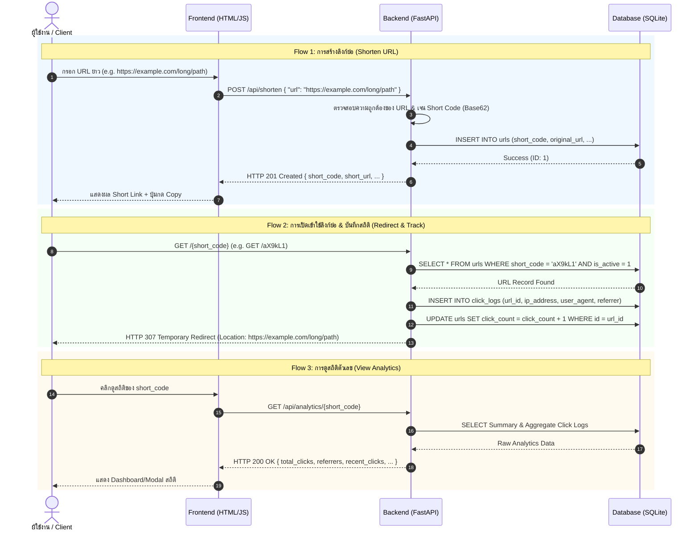

# HANDOFF.md — System Architecture Specification & Implementation Plan
**Project:** Short URL + Analytics System (v2)  
**Author:** Agent A — Architect  
**Target Audience:** Agent B — Builder (Implementation Agent)  
**Date:** 2026-08-08  
**Status:** Approved Architecture Specification  

---

## 1. ภาพรวมระบบ (System Overview)

ระบบ **Short URL + Analytics** เป็นเว็บแอปพลิเคชันขนาดเล็กแบบ Self-contained ที่ถูกออกแบบมาสำหรับรันบนเครื่อง Local (Windows) เพื่อทำหน้าที่:
1. **ย่อลิงก์ (URL Shortening):** รับ URL ยาว (Long URL) และแปลงเป็นรหัสย่อสั้นๆ (Short Code เช่น `aX9kL1`)
2. **นำทางกลับอัตโนมัติ (URL Redirection):** เมื่อเปิดลิงก์ย่อ (`http://localhost:8000/{short_code}`) ระบบจะพาผู้ใช้นำทาง (HTTP 307 Redirect) ไปยัง URL ต้นทางทันที
3. **บันทึกสถิติและวิเคราะห์ผล (Analytics Tracking):** ทุกครั้งที่มีการเข้าผ่านลิงก์ย่อ ระบบจะบันทึกข้อมูลการเข้าถึง (Timestamp, IP Address, User-Agent, Referrer) เพื่อนำมาประมวลผลสรุปจำนวนคลิกและสถิติการใช้งาน



---

## 2. ข้อกำหนดทาง Technical & Stack Selection

### 2.1 Backend Framework: Python 3.10+ + FastAPI
- **เหตุผลที่เลือก:**
  - ติดตั้งง่าย รันรวดเร็ว ไม่มี Overhead สูง
  - มี Interactive OpenAPI Documentation (`/docs` และ `/redoc`) ในตัวอัตโนมัติ ช่วยให้ทดสอบและ debug สะดวก
  - รองรับ Async operations ทำให้กระบวนการบันทึก Log และ Redirect ทำได้รวดเร็ว
  - รันง่ายบน Windows ผ่าน `uvicorn` ด้วยคำสั่งเดียว

### 2.2 Database: SQLite3 (`shortener.db`)
- **เหตุผลที่เลือก:**
  - เป็น File-based Database ในตัวของ Python Standard Library (`sqlite3`) ไม่ต้องติดตั้ง external database engine หรือ Docker ให้ยุ่งยาก
  - รองรับ ACID Transaction เพียงพอสำหรับการทำงานระดับ local และสเกลเล็ก-กลาง
  - เคลื่อนย้ายง่าย สามารถลบไฟล์ `shortener.db` เพื่อ reset state ทดสอบใหม่ได้ทันที

### 2.3 Frontend: Vanilla HTML5 + CSS3 + JavaScript (Fetch API)
- **เหตุผลที่เลือก:**
  - ไม่ใช้ Framework ใหญ่ (เช่น React, Vue, Angular) เพื่อลดขนาดความซับซ้อนและไม่ต้องรัน `npm build`
  - ใช้ Single Page Application (SPA) เรียบง่าย เสิร์ฟโดยตรงจาก FastAPI `StaticFiles`
  - ตกแต่งสไตล์ให้สวยงาม ทันสมัย Responsive (Clean Dark/Light Theme with glassmorphism touches)

### 2.4 โครงสร้างไดเรกทอรีโปรเจกต์ (Project Directory Structure)
Builder (Agent B) ต้องจัดวางไฟล์ตามโครงสร้างนี้:

```text
D:\AI-Workspace\projects\short-url-analytics-test-v2\
├── HANDOFF.md               # [Agent A] เอกสารสเปกและสถาปัตยกรรมระบบ (ไฟล์นี้)
├── requirements.txt         # รายชื่อ Python package dependencies
├── app/
│   ├── __init__.py
│   ├── main.py              # จุดเริ่มต้น FastAPI app, รัน server, static route
│   ├── database.py          # SQLite connection pool/helper & DDL Table auto-init
│   ├── models.py            # Pydantic schemas สำหรับ request/response validation
│   ├── utils.py             # Short code generator (Base62/Random) & URL Validator
│   └── static/              # โฟลเดอร์เก็บไฟล์ Frontend
│       ├── index.html       # หน้า UI หลัก (Form สร้างลิงก์ + List ลิงก์ + สถิติ)
│       ├── style.css        # สไตล์การแต่งหน้าจอ
│       └── app.js           # Logic ฝั่ง Client เรียกใช้ API
├── tests/
│   ├── __init__.py
│   └── test_api.py          # Pytest suite สำหรับทดสอบ API ทุก endpoint
└── README.md                # คู่มือการติดตั้งและรันโปรเจกต์สำหรับผู้ใช้
```

---

## 3. รายละเอียด DB Schema (SQLite Database Schema)

ฐานข้อมูลประกอบด้วย 2 ตารางหลัก (`urls` และ `click_logs`)

### 3.1 ตาราง `urls` (เก็บข้อมูลลิงก์)
ใช้สำหรับเก็บ mapping ระหว่าง `short_code` และ `original_url`

| Column Name | Data Type | Constraints | Description |
| :--- | :--- | :--- | :--- |
| `id` | `INTEGER` | `PRIMARY KEY AUTOINCREMENT` | รหัสอ้างอิงลำดับรายการ |
| `short_code` | `TEXT` | `UNIQUE NOT NULL` | รหัสย่อ (เช่น `aX9kL1`) มีดัชนี Index |
| `original_url` | `TEXT` | `NOT NULL` | URL ต้นทางความยาวเต็ม |
| `created_at` | `DATETIME` | `DEFAULT CURRENT_TIMESTAMP NOT NULL` | เวลาที่สร้างรายการ |
| `is_active` | `INTEGER` | `DEFAULT 1 NOT NULL` | สถานะเปิดใช้งาน (1 = Active, 0 = Disabled) |
| `click_count` | `INTEGER` | `DEFAULT 0 NOT NULL` | จำนวนคลิกรวมสะสม (Cached counter เพื่อความเร็ว) |

### 3.2 ตาราง `click_logs` (เก็บประวัติการเข้าชมแบบละเอียด)
ใช้สำหรับบันทึก event การเข้าชมแต่ละครั้งเพื่อทำ Analytics

| Column Name | Data Type | Constraints | Description |
| :--- | :--- | :--- | :--- |
| `id` | `INTEGER` | `PRIMARY KEY AUTOINCREMENT` | รหัสไอดีของคลิก |
| `url_id` | `INTEGER` | `NOT NULL, FOREIGN KEY REFERENCES urls(id) ON DELETE CASCADE` | รหัสอ้างอิงไปยังตาราง `urls` |
| `clicked_at` | `DATETIME` | `DEFAULT CURRENT_TIMESTAMP NOT NULL` | เวลาที่เกิดการกดเข้าลิงก์ |
| `ip_address` | `TEXT` | `NULLABLE` | IP Address ของผู้เข้าชม (เช่น `127.0.0.1`) |
| `user_agent` | `TEXT` | `NULLABLE` | ข้อมูล Web Browser / Client Header |
| `referrer` | `TEXT` | `NULLABLE` | เว็บไซต์ต้นทางที่คลิกมา (ถ้าไม่มีให้บันทึกเป็น `Direct`) |

### 3.3 SQL DDL (คำสั่งสร้างตาราง SQLite)
Builder สามารถใช้ SQL ต่อไปนี้ใน `database.py` เพื่อสร้างตารางอัตโนมัติเมื่อแอปเริ่มต้นทำงาน:

```sql
-- สร้างตาราง urls
CREATE TABLE IF NOT EXISTS urls (
    id INTEGER PRIMARY KEY AUTOINCREMENT,
    short_code TEXT UNIQUE NOT NULL,
    original_url TEXT NOT NULL,
    created_at DATETIME DEFAULT CURRENT_TIMESTAMP NOT NULL,
    is_active INTEGER DEFAULT 1 NOT NULL,
    click_count INTEGER DEFAULT 0 NOT NULL
);

-- สร้างตาราง click_logs
CREATE TABLE IF NOT EXISTS click_logs (
    id INTEGER PRIMARY KEY AUTOINCREMENT,
    url_id INTEGER NOT NULL,
    clicked_at DATETIME DEFAULT CURRENT_TIMESTAMP NOT NULL,
    ip_address TEXT,
    user_agent TEXT,
    referrer TEXT,
    FOREIGN KEY (url_id) REFERENCES urls(id) ON DELETE CASCADE
);

-- สร้าง Indexes เพื่อเร่งความเร็วในการค้นหา
CREATE INDEX IF NOT EXISTS idx_urls_short_code ON urls(short_code);
CREATE INDEX IF NOT EXISTS idx_click_logs_url_id ON click_logs(url_id);
CREATE INDEX IF NOT EXISTS idx_click_logs_clicked_at ON click_logs(clicked_at);
```

---

## 4. รายการ API Endpoint Specifications

### 4.1 `POST /api/shorten` — สร้าง Short URL ใหม่
- **Method:** `POST`
- **Path:** `/api/shorten`
- **Description:** ย่อ URL ยาวให้เป็น Short Code (รองรับการกำหนด custom_code เพิ่มเติมถ้าต้องการ)
- **Request Headers:** `Content-Type: application/json`
- **Request Body:**
  ```json
  {
    "url": "https://www.example.com/articles/2026/deep-dive-python-fastapi-guide",
    "custom_code": "fastapi-guide" 
  }
  ```
  *(หมายเหตุ: `custom_code` เป็น optional field หากไม่ส่งมา ให้ระบบสุ่มรหัส Base62 ความยาว 6 หลักอัตโนมัติ)*

- **Response Status 201 Created:**
  ```json
  {
    "short_code": "fastapi-guide",
    "short_url": "http://localhost:8000/fastapi-guide",
    "original_url": "https://www.example.com/articles/2026/deep-dive-python-fastapi-guide",
    "created_at": "2026-08-08T17:55:00Z",
    "click_count": 0
  }
  ```
- **Response Status 400 Bad Request:**
  - รูปแบบ URL ไม่ถูกต้อง (`Invalid URL format`)
  - `custom_code` ซ้ำกับที่มีในระบบแล้ว (`Custom short code already exists`)

---

### 4.2 `GET /{short_code}` — Redirection ไปยัง URL ต้นทาง
- **Method:** `GET`
- **Path:** `/{short_code}` (เช่น `/aX9kL1`)
- **Description:** นำทางผู้ใช้ไปยัง `original_url` พร้อมบันทึก Click Event ลงใน `click_logs` และอัปเดต `click_count`
- **Response Status 307 Temporary Redirect:**
  - **Response Header:** `Location: https://www.example.com/articles/...`
- **Response Status 404 Not Found:**
  - เมื่อไม่พบ `short_code` ในระบบ หรือ `is_active = 0`

---

### 4.3 `GET /api/analytics/{short_code}` — เรียกดูข้อมูลสถิติของ Short Link
- **Method:** `GET`
- **Path:** `/api/analytics/{short_code}`
- **Description:** คืนค่าสถิติการใช้งานของ short link ทั้งหมด
- **Response Status 200 OK:**
  ```json
  {
    "short_code": "fastapi-guide",
    "original_url": "https://www.example.com/articles/2026/deep-dive-python-fastapi-guide",
    "created_at": "2026-08-08T17:55:00Z",
    "is_active": true,
    "total_clicks": 15,
    "last_clicked_at": "2026-08-08T18:12:30Z",
    "referrers": [
      { "source": "Direct / None", "count": 10 },
      { "source": "https://t.co/", "count": 3 },
      { "source": "https://facebook.com/", "count": 2 }
    ],
    "recent_clicks": [
      {
        "clicked_at": "2026-08-08T18:12:30Z",
        "ip_address": "127.0.0.1",
        "user_agent": "Mozilla/5.0 (Windows NT 10.0; Win64; x64) ...",
        "referrer": "Direct / None"
      }
    ]
  }
  ```
- **Response Status 404 Not Found:**
  - เมื่อไม่พบ `short_code`

---

### 4.4 `GET /api/links` — รายการลิงก์ทั้งหมด (สำหรับ Dashboard)
- **Method:** `GET`
- **Path:** `/api/links`
- **Query Parameters:** `limit` (default: 20), `offset` (default: 0)
- **Description:** ดึงรายการ Short Links ที่ถูกสร้างล่าสุดพร้อมยอดคลิกรวม
- **Response Status 200 OK:**
  ```json
  {
    "total": 1,
    "items": [
      {
        "short_code": "fastapi-guide",
        "short_url": "http://localhost:8000/fastapi-guide",
        "original_url": "https://www.example.com/articles/2026/deep-dive-python-fastapi-guide",
        "created_at": "2026-08-08T17:55:00Z",
        "click_count": 15
      }
    ]
  }
  ```

---

## 5. สิ่งที่ Builder (Agent B) ต้องดำเนินการให้ครบถ้วน

Builder (คนถัดไป) ต้องปฏิบัติตามแผนงานและเกณฑ์การยอมรับ (Acceptance Criteria) ต่อไปนี้:

### Step 1: สภาพแวดล้อมและการจัดเตรียมโปรเจกต์ (Environment Setup)
- [ ] สร้างไฟล์ `requirements.txt` ที่มีอย่างน้อย:
  - `fastapi>=0.100.0`
  - `uvicorn[standard]>=0.20.0`
  - `pydantic>=2.0.0`
  - `pytest>=7.0.0`
  - `httpx>=0.24.0` (สำหรับ pytest async client)
- [ ] สร้างโครงสร้างไดเรกทอรี `app/` และ `tests/` ตามสเปก

### Step 2: Database Initialization (`app/database.py`)
- [ ] เขียนฟังก์ชันเชื่อมต่อ SQLite (`sqlite3.connect("shortener.db", check_same_thread=False)`)
- [ ] เปิดใช้งาน Foreign Key constraints (`PRAGMA foreign_keys = ON;`)
- [ ] เขียนฟังก์ชัน `init_db()` เพื่อรัน SQL DDL สร้างตารางและ Index อัตโนมัติเมื่อเริ่มแอป

### Step 3: Core Algorithm & Helpers (`app/utils.py`)
- [ ] **Short Code Generator:** สร้างฟังก์ชันแปลงเลขสุ่มหรือ UUID ให้เป็นอักขระ Base62 (`0-9, a-z, A-Z`) ความยาว 6 ตัวอักษร
- [ ] **Collision Handling:** หากสุ่มได้รหัสที่ซ้ำใน DB ให้วนสุ่มใหม่ (สูงสุด 5 ครั้ง)
- [ ] **URL Validator:** ตรวจสอบความถูกต้องของ URL (ต้องขึ้นต้นด้วย `http://` หรือ `https://`)

### Step 4: Backend API Implementation (`app/main.py` & `app/models.py`)
- [ ] สร้าง Pydantic models สำหรับ Request Body และ Response Schemas
- [ ] Implement endpoint `POST /api/shorten`
- [ ] Implement endpoint `GET /{short_code}` (ส่ง 307 Redirect พร้อมบันทึก log ลง `click_logs`)
- [ ] Implement endpoint `GET /api/analytics/{short_code}`
- [ ] Implement endpoint `GET /api/links`
- [ ] Mount โฟลเดอร์ `app/static` สำหรับเสิร์ฟ Frontend static files (`GET /`)

### Step 5: Frontend UI Development (`app/static/`)
- [ ] **`index.html`:** หน้าตาเรียบง่าย ทันสมัย
  - Input field สำหรับวาง URL ยาว + ปุ่ม "Shorten URL"
  - Card/Modal แสดงลิงก์ย่อที่สร้างเสร็จ พร้อมปุ่ม "Copy Link"
  - Table/List แสดงประวัติลิงก์ย่อทั้งหมดที่เคยสร้าง พร้อมปุ่ม "View Analytics"
  - Analytics Modal/Panel แสดงจำนวนคลิกรวม, กราฟ/รายการผู้เข้าชม และ Referrer
- [ ] **`app.js`:** ใช้ Vanilla JS `fetch()` ดึงข้อมูลจาก API แบบไม่ต้อง Refresh หน้า

### Step 6: Testing & Verification (`tests/test_api.py`)
- [ ] เขียน Test Case ครอบคลุม:
  1. `test_create_short_link()`: สร้างลิงก์ย่อสำเร็จ คืนค่า 201 พร้อม short_code
  2. `test_redirect_short_link()`: ยิง `GET /{short_code}` แล้วได้ status 307 และได้ Header Location ตรงตาม original_url
  3. `test_analytics_increment()`: ตรวจสอบว่า `total_clicks` เพิ่มขึ้นจาก 0 เป็น 1 หลังจากมีการเรียกใช้ redirect link
  4. `test_invalid_url()`: ส่ง URL ผิดรูปแบบ แล้วได้ 400 Bad Request
  5. `test_not_found()`: เข้า `GET /nonexistent` แล้วได้ 404 Not Found

---

## 6. คำแนะนำในการรันและทดสอบระบบ (Local Run Commands)

```powershell
# 1. ติดตั้ง Dependencies
pip install -r requirements.txt

# 2. เริ่มต้นรันแอปพลิเคชัน
python -m uvicorn app.main:app --reload --port 8000

# 3. เปิดเบราว์เซอร์ใช้งาน
# - Web UI: http://localhost:8000
# - API Documentation: http://localhost:8000/docs

# 4. รันชุดทดสอบ Automated Tests
pytest
```

---
*เอกสารนี้ได้รับการตรวจสอบและอนุมัติโดย Agent A (Architect) เพื่อให้ Agent B (Builder) นำไปพัฒนาระบบจริงทันที*
